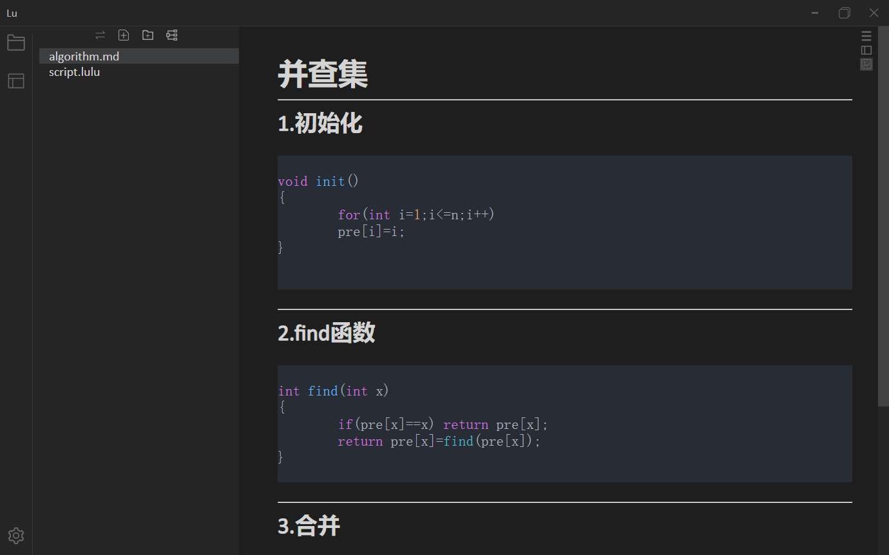
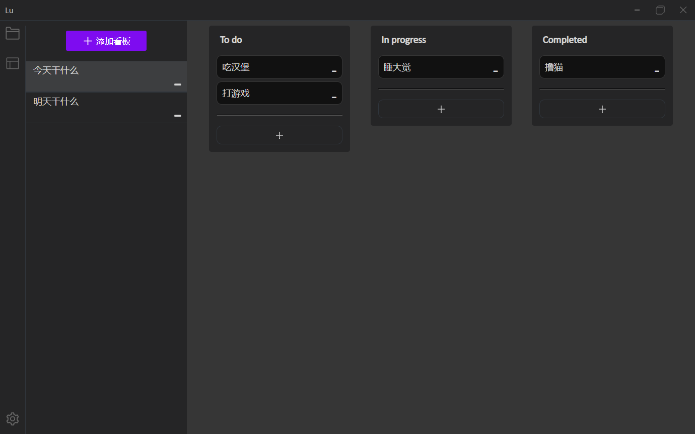

# lulu

lulu 是一款允许在笔记中运行`javascript`代码和编辑`markdown`文本的桌面应用程序

文档地址：https://teashirtt.github.io/lulu/

## 主要功能

- 在`markdown`类型的文件中可以编辑并预览`markdown`内容，目录跳转，切换代码块主题
- 在`lulu`类型的文件中可以编辑并预览`markdown`内容，执行`javascript`代码
- 提供`kanban`功能，可以新建，删除和拖拽任务列表

## 项目构建

tauri + vue + rust

## 项目截图

- `lulu` 文件

- `markdown`文件

- `kanban`功能

- 用户设置
